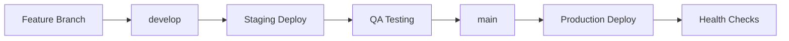
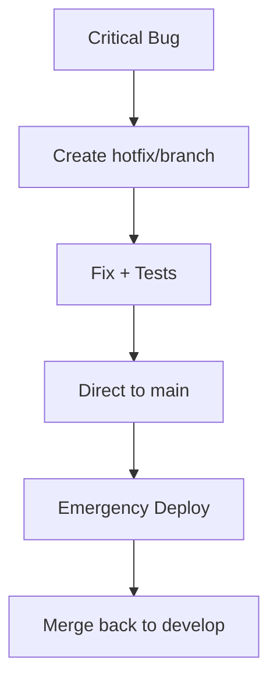

# 🚀 Estrategia de Despliegue - Sistema Expedientes Dentales

## 📋 Resumen Ejecutivo

Este documento define la estrategia de despliegue para el backend del Sistema de Expedientes Dentales en Vercel, implementando un flujo de CI/CD robusto con ambientes de staging y producción.

## 🏗️ Arquitectura de Despliegue

### 🌍 Ambientes

| Ambiente | Propósito | URL | Rama | Auto-Deploy |
|----------|-----------|-----|------|-------------|
| **Development** | Desarrollo local | `localhost:3000` | `feature/*` | ❌ |
| **Staging** | Testing y QA | `staging-api.dental.com` | `develop` | ✅ |
| **Production** | Usuarios finales | `api.dental.com` | `main` | ✅ |

### 🔄 Flujo de Trabajo (GitFlow)



## 🎯 Estrategias por Ambiente

### 🧪 Staging Environment

**Propósito**: Validación de funcionalidades antes de producción

**Características**:
- Deploy automático en push a `develop`
- Base de datos de testing separada
- Logs detallados habilitados
- Rate limiting relajado para testing
- Datos de prueba pre-cargados

**Configuración**:
```yaml
Environment: staging
Database: supabase-staging
Logging: debug
Rate Limit: 1000 req/min
Monitoring: basic
```

**Triggers de Deploy**:
- ✅ Push a rama `develop`
- ✅ Pull Request a `main`
- ✅ Deploy manual via GitHub Actions
- ❌ Commits directos

### 🌟 Production Environment

**Propósito**: Servicio a usuarios finales con máxima estabilidad

**Características**:
- Deploy automático solo desde `main`
- Base de datos de producción
- Logs optimizados (warn/error)
- Rate limiting estricto
- Monitoreo completo
- Rollback automático en fallos

**Configuración**:
```yaml
Environment: production
Database: supabase-production
Logging: warn
Rate Limit: 100 req/min
Monitoring: full
Backup: automated
```

**Triggers de Deploy**:
- ✅ Push a rama `main`
- ✅ Deploy manual con aprobación
- ✅ Hotfix desde `hotfix/*`
- ❌ Deploy directo sin testing

## 🔒 Proceso de Aprobación

### 📝 Pull Request Requirements

**Para Staging (`develop`)**:
- ✅ Tests unitarios pasando
- ✅ Revisión de código (1 aprobación)
- ✅ Build exitoso
- ❌ Aprobación manual

**Para Producción (`main`)**:
- ✅ Tests completos (unit + integration)
- ✅ Revisión de código (2 aprobaciones)
- ✅ Testing en staging exitoso
- ✅ Aprobación manual del tech lead
- ✅ Health checks pasando

### 🚨 Hotfix Process



## 🔍 Quality Gates

### 🧪 Testing Requirements

| Ambiente | Unit Tests | Integration | E2E | Coverage |
|----------|------------|-------------|-----|----------|
| Staging | ✅ | ✅ | ❌ | 80%+ |
| Production | ✅ | ✅ | ✅ | 90%+ |

### 📊 Performance Benchmarks

| Métrica | Staging | Production |
|---------|---------|------------|
| Response Time | < 500ms | < 200ms |
| Uptime | 95%+ | 99.9%+ |
| Error Rate | < 5% | < 0.1% |

## 🚀 Deployment Process

### 🔄 Automated Deployment

1. **Code Push** → Trigger GitHub Actions
2. **Testing** → Run test suite
3. **Build** → Compile TypeScript
4. **Deploy** → Vercel deployment
5. **Verify** → Health checks
6. **Notify** → Team notification

### 🛠️ Manual Deployment

```bash
# Deploy to staging
npm run deploy:preview

# Deploy to production
npm run deploy

# Rollback (if needed)
vercel rollback --token=$VERCEL_TOKEN
```

## 📈 Monitoring & Alerting

### 🔍 Health Checks

**Staging**:
- Endpoint: `/health`
- Frequency: 5 minutes
- Timeout: 30 seconds

**Production**:
- Endpoint: `/health`
- Frequency: 1 minute
- Timeout: 10 seconds
- Alerting: Slack + Email

### 📊 Metrics Tracking

| Métrica | Tool | Threshold |
|---------|------|-----------|
| Response Time | Vercel Analytics | 200ms |
| Error Rate | Vercel Logs | 0.1% |
| Uptime | UptimeRobot | 99.9% |
| Memory Usage | Vercel Functions | 80% |

## 🔧 Configuration Management

### 🌍 Environment Variables

**Staging**:
```env
NODE_ENV=staging
SUPABASE_URL=https://staging.supabase.co
LOG_LEVEL=debug
RATE_LIMIT_MAX=1000
```

**Production**:
```env
NODE_ENV=production
SUPABASE_URL=https://production.supabase.co
LOG_LEVEL=warn
RATE_LIMIT_MAX=100
```

### 🔐 Secrets Management

- **GitHub Secrets**: CI/CD tokens
- **Vercel Environment**: Runtime secrets
- **Supabase**: Database credentials
- **JWT**: Signing keys

## 🚨 Incident Response

### 🔥 Rollback Strategy

**Automatic Rollback**:
- Health check failures (3 consecutive)
- Error rate > 5% for 5 minutes
- Response time > 1000ms for 10 minutes

**Manual Rollback**:
```bash
# Via Vercel CLI
vercel rollback --token=$VERCEL_TOKEN

# Via GitHub Actions
# Trigger rollback workflow
```

### 📞 Escalation Process

1. **Alert** → Automated monitoring
2. **Investigate** → On-call engineer
3. **Mitigate** → Rollback if needed
4. **Communicate** → Status page update
5. **Resolve** → Root cause analysis

## 📚 Runbooks

### 🚀 Standard Deployment

1. Create feature branch from `develop`
2. Implement changes with tests
3. Create PR to `develop`
4. Review and merge → Auto-deploy to staging
5. Test in staging environment
6. Create PR from `develop` to `main`
7. Review and merge → Auto-deploy to production
8. Monitor deployment health

### 🔧 Hotfix Deployment

1. Create `hotfix/` branch from `main`
2. Implement critical fix with tests
3. Create PR directly to `main`
4. Emergency review and approval
5. Merge → Auto-deploy to production
6. Monitor closely
7. Merge back to `develop`

## 📋 Checklist de Despliegue

### ✅ Pre-Deployment

- [ ] Tests pasando (unit + integration)
- [ ] Code review completado
- [ ] Variables de entorno configuradas
- [ ] Base de datos migrada
- [ ] Documentación actualizada

### ✅ Post-Deployment

- [ ] Health checks pasando
- [ ] Logs sin errores críticos
- [ ] Performance dentro de SLA
- [ ] Funcionalidades críticas verificadas
- [ ] Team notificado

## 🔮 Roadmap

### 🎯 Próximas Mejoras

- **Blue-Green Deployment**: Zero-downtime deployments
- **Canary Releases**: Gradual rollout
- **Feature Flags**: Runtime feature control
- **A/B Testing**: Performance comparison
- **Multi-Region**: Global deployment

### 📊 Métricas de Éxito

- Deployment frequency: Daily
- Lead time: < 2 hours
- MTTR: < 30 minutes
- Change failure rate: < 5%

---

## 📞 Contactos

| Rol | Persona | Slack | Email |
|-----|---------|-------|-------|
| Tech Lead | @fabrizzio | #backend | fabrizzio@dental.com |
| DevOps | @devops-team | #devops | devops@dental.com |
| QA Lead | @qa-team | #qa | qa@dental.com |

---

*Última actualización: $(date)*
*Versión: 1.0*